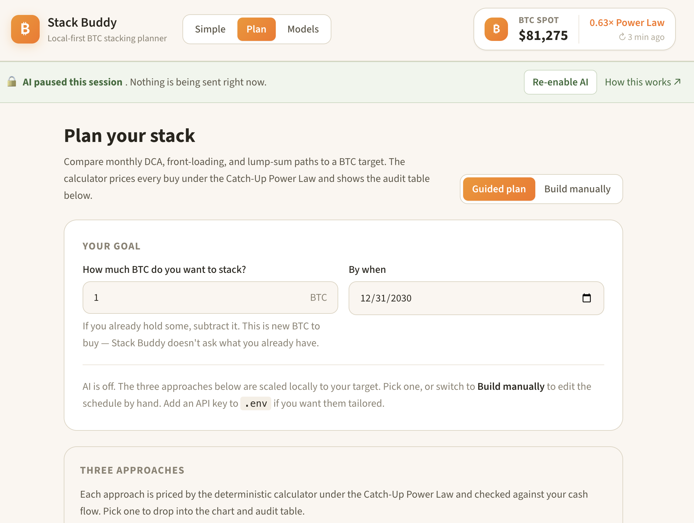
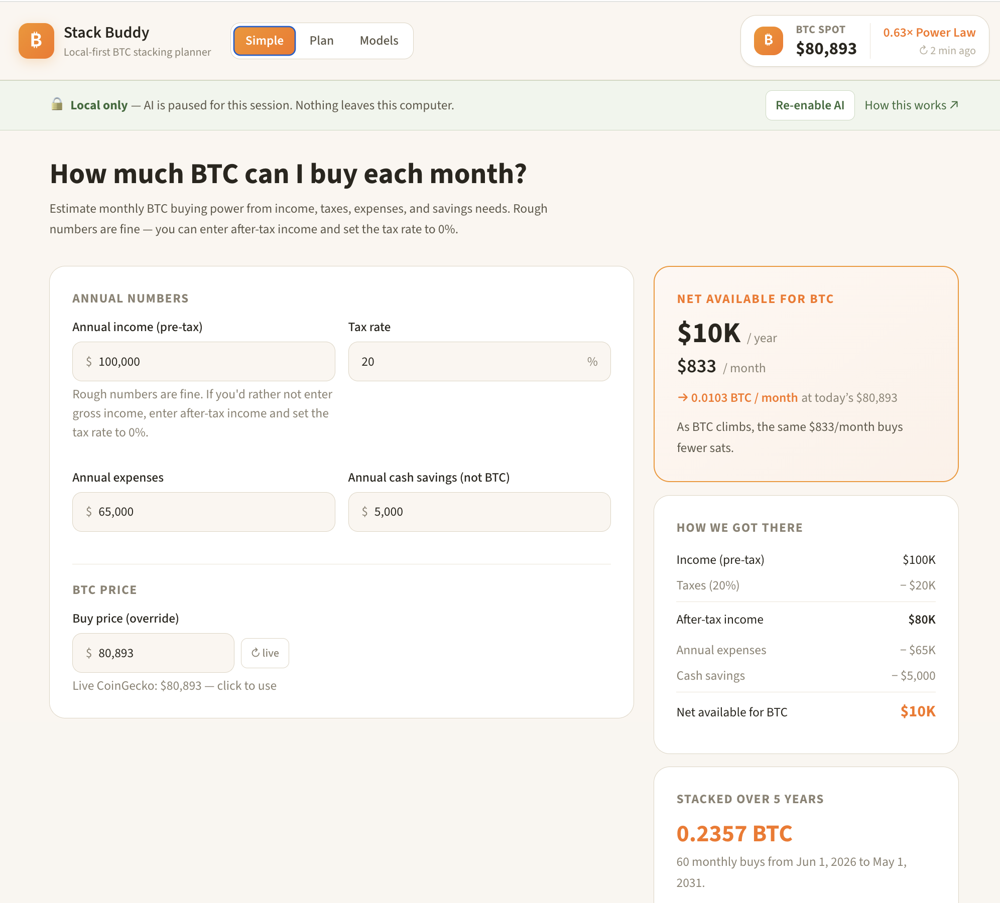
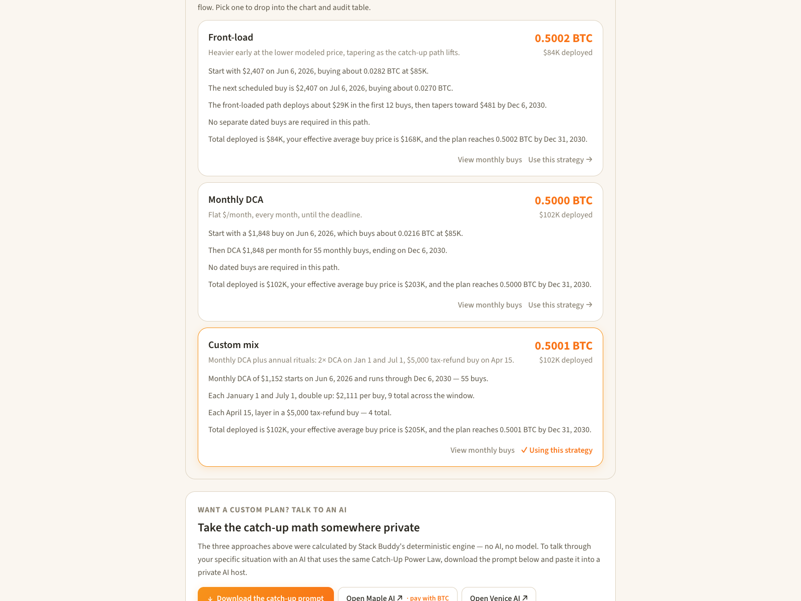
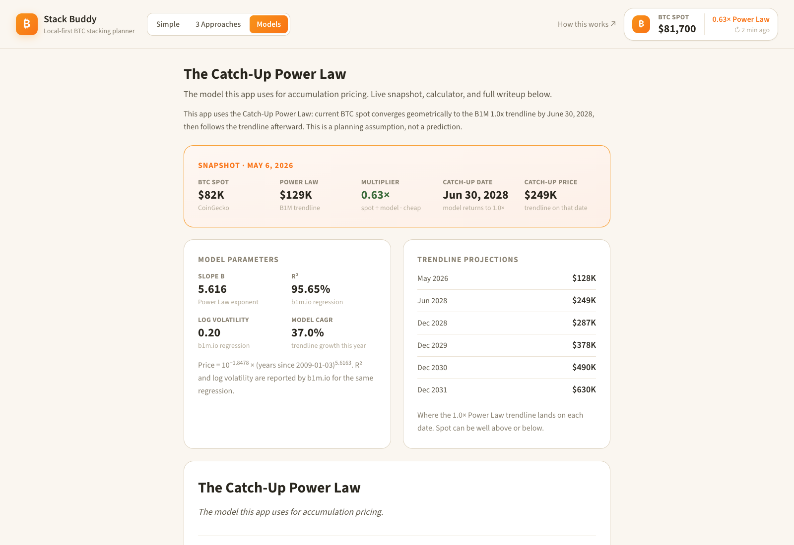
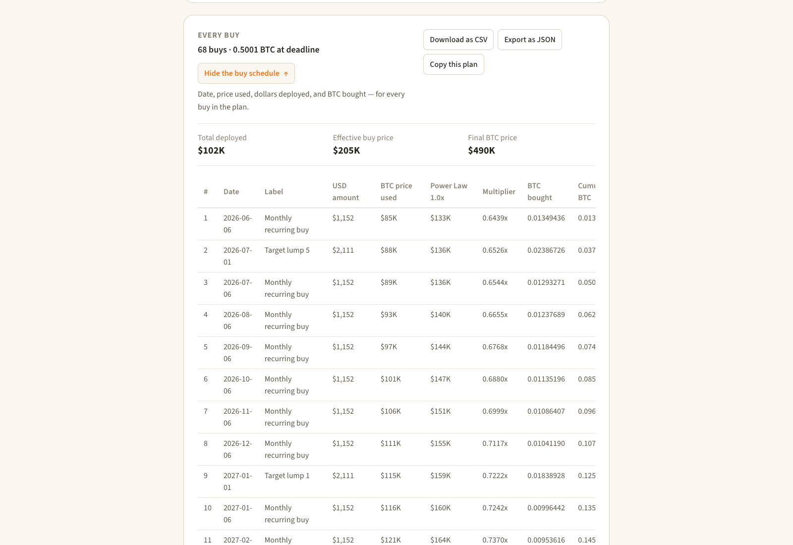
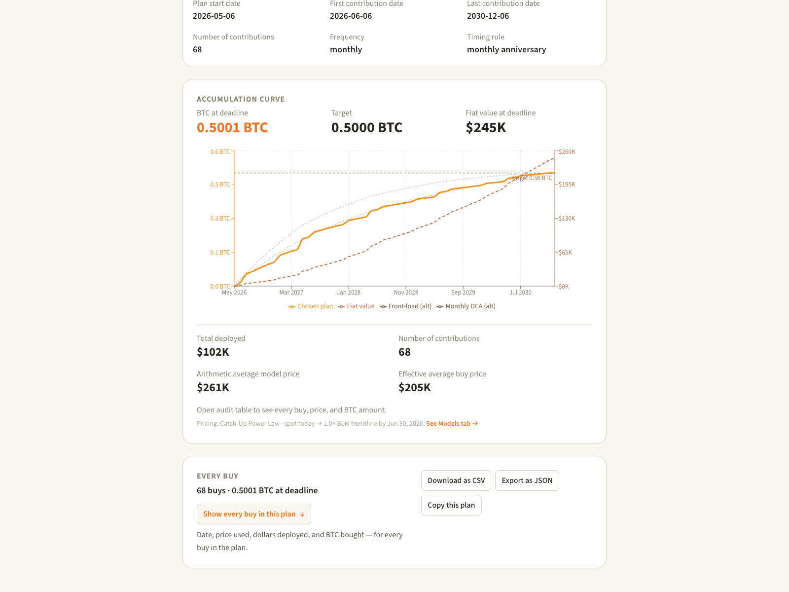
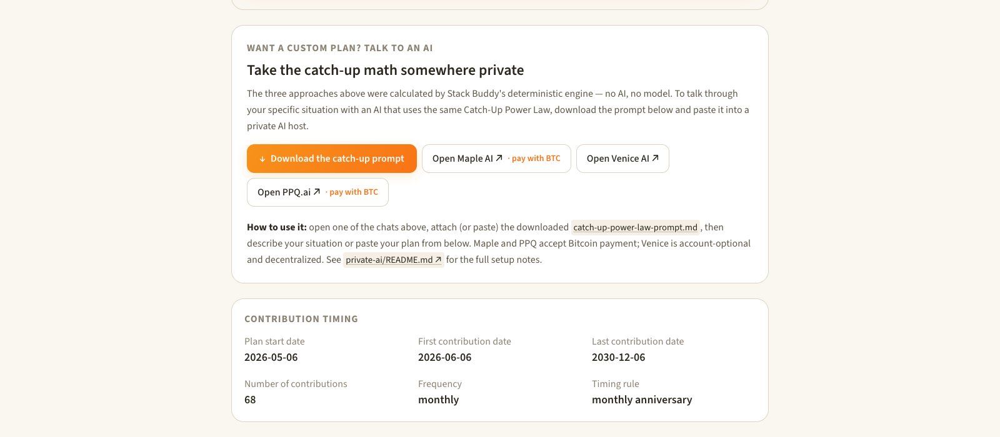

# Stack Buddy

**Live:** [orangedaddocs.github.io/stack-buddy](https://orangedaddocs.github.io/stack-buddy)



BTC stacking planner. Type in a target and a deadline, see what it takes.

I built this for myself and figured I'd put it up in case anyone else wants it. Not financial advice, not tax advice, not a price prediction. Just a calculator that runs in your browser with the math in plain sight.

## What it does

Two questions:

1. **How much BTC can I buy each month?** Income, taxes, expenses, savings, BTC price → net dollars available, monthly DCA budget, five-year accumulation curve.

   

2. **What schedule gets me to a BTC target by some deadline?** Compares flat monthly DCA, front-loaded buying, and a calendar-anchored Custom mix — for example a monthly DCA, plus 2× DCA on Jan 1 and Jul 1, plus a $5,000 tax-refund buy on Apr 15 each year.

   

Every buy is priced by the same model and shown in an audit table you can export as CSV or JSON.

## How it runs

A static site you load once and use in the browser. No accounts, no database, no cloud sync. Scenarios are JSON files in `scenarios/`. Exports are local files. The calculator doesn't call any LLM. The only network requests it makes are to CoinGecko for the live BTC spot price on first load. AI is intentionally not in the app — see the "AI is not in the app" section below for the privacy-respecting paste flow.

## The three planning shapes

- **Monthly DCA** — flat $X per month until the deadline.
- **Front-load** — heavier early, lighter later. Tests "earlier sats are worth more" if you think price will rise.
- **DCA plus lump sums** — a recurring schedule with dated buys layered in for bonuses, tax refunds, distributions, asset sales.

All three flow through the same audit-row engine and end up in the same exportable table.

## The pricing model — Catch-Up Power Law

Anchor on today's BTC spot, glide-path geometrically to the B1M Power Law 1.0× trendline by **2028-06-30**, follow the trendline after.

That's it. Three pieces: today's price, a convergence path, trend-following afterward. Default anchor multiplier is 1.0×. Both the date and the multiplier are editable in the model code; both are visible in the Models tab.

The Models tab walks through the math and shows where the trendline lands on various dates. Full writeup: [docs/models/catch-up-power-law.md](docs/models/catch-up-power-law.md).



It's a planning assumption, not a forecast. Change the assumption and the plan changes. That's the point.

## Auditability

Every projection emits a row per buy: date, label, USD amount, BTC price used, the 1.0× trendline price on that date, the multiplier (price ÷ trendline), BTC bought, cumulative BTC, cumulative dollars deployed, fiat value. The displayed totals reconcile against the row sums before they're shown; if anything is out of sync, the UI flags it red.



Three buttons on the panel: download as CSV, export as JSON, or copy the whole plan as a JSON packet for pasting into an AI session.

The accumulation curve chart shows the chosen plan in orange next to faint alternative-strategy curves and the fiat-value line. Custom mix shows visible bumps from the Jan 1, Jul 1, and Apr 15 buys — different shape from a flat DCA curve:



## Income inputs

The Simple tab takes gross income plus a tax rate. If you'd rather not enter gross income:

- enter after-tax income and set the tax rate to 0%, or
- skip the Simple tab and use the Plan tab manual mode with your own monthly contribution.

Don't put seed phrases, private keys, exchange logins, or tax documents into this thing. None of that is needed for planning.

## AI is not in the app — it's a separate paste

Stack Buddy itself is deterministic. **The calculator does not call any LLM, and there is no in-app chat.** To talk through your plan with an AI, click **"Download the catch-up prompt"** on the 3 Approaches tab. The downloaded file has the same Catch-Up Power Law math the calculator uses. Paste it into a private AI host — Maple, Venice, or PPQ — and ask away. Maple and PPQ accept Bitcoin payment.



See [`private-ai/`](private-ai/) for setup notes — privacy postures of each host, what NOT to paste, the full workflow.

## What this isn't

Not financial, tax, or legal advice. Not a trading bot. Not a price prediction. Not a Monte Carlo simulator. Not a portfolio optimizer. Not a retirement planner. Not a SaaS.

## Run it locally

```bash
npm install
npm run dev
```

Opens at `http://localhost:2035`. No `.env` required — there's no backend; the calculator is pure client-side JavaScript.

| Script | What it does |
|---|---|
| `npm run dev` | Vite dev server with hot reload |
| `npm run build` | Static build to `web/dist/` (this is what GitHub Pages serves) |
| `npm run preview` | Serve the production build locally for testing |
| `npm test` | Vitest (math + schema) |
| `npm run typecheck` | `tsc -b` |
| `npm run lint` | ESLint over .ts/.tsx |

Stack: Vite + React + TypeScript + Tailwind + Recharts. All client-side — no backend, no database, no accounts. Active math engine: [shared/math/planningAudit.ts](shared/math/planningAudit.ts).

## Hosted vs self-hosted — the trust shift

The live site at [orangedaddocs.github.io/stack-buddy](https://orangedaddocs.github.io/stack-buddy) is the same code as the repo, built and served by GitHub Pages. The math runs in your browser; nothing is sent server-side. The only outbound network call is to CoinGecko for the live BTC spot price (same as running locally).

What changes when you visit the hosted version vs cloning:

- **GitHub Pages sees your IP and user agent**, like any web server. Standard server logs. Doesn't see the numbers you type.
- **You're trusting the served JS to be clean**, rather than reading every line yourself.

For verifiability-maximalist Bitcoiners: clone the repo, run `npm run dev`, and verify the source. Same code, no IP visible to GitHub. For everyone else: the hosted version is fine.

## Troubleshooting

**Port 2035 conflict.** Change `port` in [web/vite.config.ts](web/vite.config.ts).

**BTC price shows `—` or `(stale)`.** CoinGecko's free endpoint rate-limits sometimes. The Simple tab lets you type a price directly to override.

## Status

Personal project. I'm not promising bug fixes, features, or uptime. Issues are fine to open. Forks are fine.

## Disclaimer

See [DISCLAIMER.md](DISCLAIMER.md), [PRIVACY.md](PRIVACY.md), [SUPPORT.md](SUPPORT.md). Short version: this is a planning tool, the math is visible, you own all the inputs and outputs, and bad assumptions produce bad outputs.

## License

MIT.
